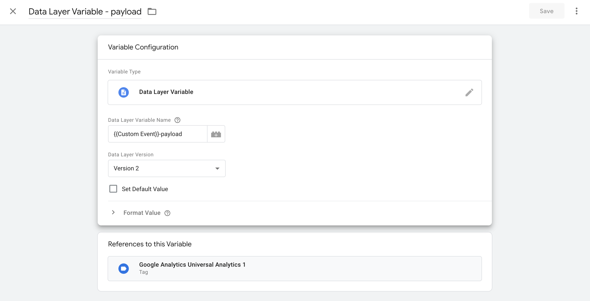
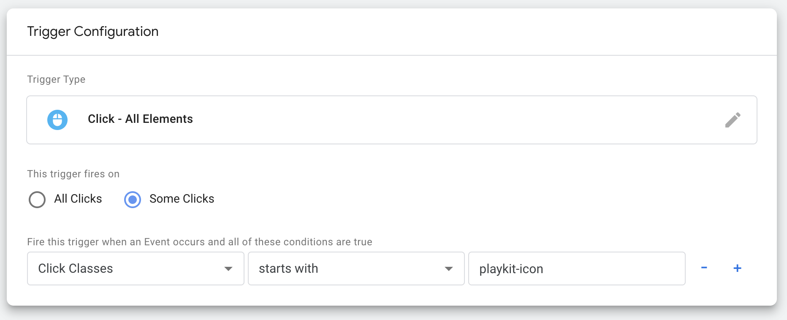

# Usage guide

- [Getting started](#getting-started)
  - [First step: setup](#first-step-setup)
  - [Second step: configure your container id](#second-step-configure-your-container-id)
- [Using Data Layer Variables](#Using-Data-Layer-Variables)
- [Tracking Player Custom Events](#tracking-player-custom-events)
- [Tracking Player UI Elements Clicks](#tracking-player-ui-elements-clicks)
- [Player CSS Elements Selectors List](#Use-the-following-css-class-selectors)
## Getting started

### First step: setup

First include the plugin script bundle **after** kaltura-player script in your web page.

```html
<script src="https://raw.githack.com/kaltura/kaltura-player-js/master/dist/kaltura-ovp-player.js"></script>
<script src="./playkit-google-tag-manager.js"></script>
```

Add the plugin name to the player config under the plugins section along with the rest of plugins.

```js
const config = {
    targetId: 'player-placeholder',
    provider: {
        partnerId: <YOUR PARTBER ID>,
    },
    plugins: {
        'google-tag-manager': {},
    }
  };

const player = KalturaPlayer.setup(config);
```

### Second step: configure your container id

Should be displayed on your admin tab in your [Google Tag Manager](https://tagmanager.google.com) dashboard (formatted as GTM-XXXXXX)

```js
const config = {
  targetId: 'player-placeholder',
  provider: {
    partnerId: <YOUR PARTBER ID>,
  },
  plugins: {
    'google-tag-manager': {
        containerId: <YOUR CONTAINER ID>
    },
  }
};

const player = KalturaPlayer.setup(config);
```

### Tracing player custom events

In order to track player custom events - just pass string array of event types to the plugin config

```js
const config = {
    ...
  },
  plugins: {
    'google-tag-manager': {
        containerId: 'GTM-XXXXXXX',
        customEvents: ['play', 'playing', 'pause', 'seeked', ...]
    },
  }
};
```
**The full list of events can be found [here](https://github.com/kaltura/playkit-js/blob/master/src/event/event-type.js)** \
**Ads events can be found [here](https://github.com/kaltura/playkit-js/blob/master/src/ads/ad-event-type.js)**

### Using Data Layer Variables

Our Player Custom Events payload are available as [Data Layer Variable](https://support.google.com/tagmanager/answer/6164391?hl=en), 
in order to use them, you would just need to set **Data Layer Variable** one time! with dynamic key as explained bellow.

The Data Layer Variable **key** would always be at the pattern of Custom Event Name concatenated with the string `-payload`

For example: `play-payload` / `seeked-payload` / `sourceselectd-payload` and so on.

**Note:** not all player custom events have a payload, in that case, the value would be _undefined_

**Set up the data layer variable**

Open your [Google Tag Manager](https://tagmanager.google.com) Workspace and follow these steps:

1. Click **Variables**.
2. Under **User-Defined Variables**, click **New**.
3. Click **Variable Configuration** and select **Data Layer Variable** as the variable type.
4. In the **Data Layer Variable Name** field,  click on the '**+**' icon and select the **Custom Event** Built-In Variable and add add the suffix `-payload` to the variable name
   
5. In most cases you should leave the **Data Layer Version** set to the default value of Version 2.
6. Save the variable.



Now you can use that Variable everywhere in your tag configuration


### Tracking player UI elements clicks

In order to track some Player elements Clicks when condition of CSS selectors are true,
You should use the 'Click Classes' option of the conditions list. 

Player elements are identified by css class selectors. (Player elements do not contain id selectors).

#### Use the following css class selectors:

| Control Element | Class Name                                                                                 |
| ---------- | ----------------------------------------------------------------------------------------------- |
| **PLAY / PAUSE**                      | `playkit-control-play-pause`                                         |
| **PLAY**                              | `playkit-icon-play`                                                  |
| **PAUSE**                             | `playkit-icon-pause`                                                 |
| **REPLAY**                             | `playkit-icon-start-over`                                                 |
| **REWIND**                            | `playkit-icon-rewind-10`                                             |
| **FORWARD**                           | `playkit-icon-forward-10`                                            |
| **VOLUME / MUTE**                     | `playkit-icon-volume-mute`                                           |
| **LANGUAGE**                          | `playkit-icon-language`                                              |
| **SETTINGS**                          | `playkit-icon-settings`                                              |
| **PICTURE IN PICTURE**                | `playkit-control-picture-in-picture`                                 |
| **PICTURE IN PICTURE / START**        | `playkit-icon-picture-in-picture-star`                               |
| **PICTURE IN PICTURE / STOP**         | `playkit-icon-picture-in-picture-stop`                               |
| **FULLSCREEN / MAXIMIZE**             | `playkit-icon-maximize`                                             |
| **FULLSCREEN / MINIMIZE**             | `playkit-icon-minimize`                                        |

For capturing all player controls clicks -select the 'contains' or 'start with' condition from the conditions and pass the `playkit-icon` class as the value.

 **Example - Single Selection**


**Example - Multiple Selection**




## Full example

[Full example](https://github.com/kaltura/playkit-js-google-tag-manager/blob/master/demo/index.html)

## Custom event trigger

[Custom event trigger](https://support.google.com/tagmanager/answer/7679219)

## About Player Events

[Player Events](https://github.com/kaltura/kaltura-player-js/blob/master/docs/events.md)
